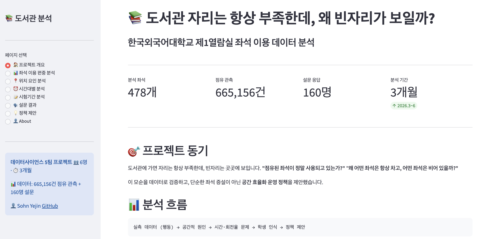

# 📚 도서관 자리는 항상 부족한데, 왜 빈자리가 보일까?

한국외국어대학교 제1열람실 데이터를 활용해 **좌석 부족 현상의 진짜 원인**을 분석하고, 좌석 증설 대신 **공간 효율화를 위한 운영 정책**을 제안한 데이터 분석 프로젝트입니다.

> 데이터사이언스 수업에서 시작하여 통계적 검정·공간 분석·설문 결합을 통해 분석을 진행하고,
> **실제로 한국외국어대학교 도서관 측에 분석 결과와 정책 제안을 전달**한 종합 프로젝트입니다.

## 🎯 프로젝트 동기

도서관에 가면 자리는 항상 부족한데, 빈자리는 곳곳에 보입니다.
**"점유된 좌석이 정말 사용되고 있는가?"** "**왜 어떤 좌석은 항상 차고, 어떤 좌석은 비어 있을까?"**

이 모순을 데이터로 검증하고, **단순한 좌석 증설이 아닌 기존 공간의 효율적 활용 방안**을 도출하는 것이 이 프로젝트의 목표입니다.

## 📊 사용 데이터 (3종 결합)

| 데이터 | 수집 방법 | 규모 | 활용 |
|---|---|---|---|
| **열람실 배치도** | 도서관 배치도 + 직접 실측 → 좌표 매핑 | 478개 좌석 + 공간 요소 | 좌석별 공간 특성 수치화 |
| **좌석 이용 로그** | 자동화 스크립트로 도서관 홈페이지 크롤링 (10분 단위 스냅샷) | 665,156건 점유 관측 | 시간·좌석별 이용 패턴 |
| **이용자 설문** | 한국외대 학생 160명 설문 | 160명 | 좌석 선택의 "왜?" 규명 |

## 🛠️ 사용 기술

- **언어**: Python 3.9+
- **라이브러리**: pandas, numpy, scipy, matplotlib, seaborn, matplotlib-venn
- **통계 기법**: 카이제곱 적합도 검정, Spearman 상관분석, Kruskal-Wallis, Mann-Whitney U (Bonferroni 보정), Gini 계수, 표준화 잔차
- **공간 분석**: 좌표 거리 계산, 가장자리 점수 모델링
- **시각화**: 배치도 히트맵, 다각도 비교 그래프, Venn diagram
- **데이터 수집**: 자동화 크롤링 스크립트

## 🔍 분석 흐름

```
실측 데이터 (행동) → 공간적 원인 → 시간·회전율 문제 → 학생 인식 → 정책 제안
```

### A. 좌석 이용 편중 분석
- 카이제곱 적합도 검정으로 좌석 이용 균일성 검정
- Gini 계수·정규화 엔트로피로 편중 강도 측정
- 표준화 잔차로 과이용·저이용 좌석 식별

### B. 좌석과 공간 요소의 위치관계
- 출입문·창문·기둥까지 최근접 거리 계산
- 가장자리 점수(0~1) 수치화
- Spearman 상관분석으로 위치 요인과 점유율 관계 검증

### C. 시간대별 점유율 차이
- 4개 시간대 비교 (새벽·오전·오후·저녁)
- Kruskal-Wallis + Mann-Whitney U 사후 검정

### D. 시험 기간 이용 패턴
- 평시·시험 직전·시험 기간 3개 그룹 비교
- 요일별·시간대별 이용 밀도 분석

### E. 설문 결합 분석 (160명)
- 응답자 프로파일 (표본 대표성)
- 인식 vs 실제 행동 차이
- 자리비움 행태 분석
- 시스템 만족도·개선안 우선순위

## 📈 주요 분석 결과

### 1. 좌석 이용은 균등하지 않다
- 좌석별 점유율: **0.0% ~ 88.6%** (큰 격차)
- 카이제곱 검정: **χ² = 170,293.6, p < .001** (균일 가설 강력 기각)
- Gini = 0.268 (중간 수준 편중), 과이용 171석 / 저이용 275석

### 2. 위치가 좌석 선택을 결정한다
| 공간 요인 | Spearman ρ | 해석 |
|---|---|---|
| 가장자리 점수 | **+0.45** (p < .001) | 벽면·외곽 선호 가장 강함 |
| 출입문 거리 | **+0.28** (p < .001) | 출입문에서 멀수록 선호 |
| 창문 거리 | **-0.22** (p < .001) | 창문 가까울수록 선호 |
| 기둥 거리 | +0.05 (p = 0.291) | 유의하지 않음 |

→ **이용자는 "심리적 안정감과 독립성이 높은 공간"을 선호**

### 3. 인기 좌석은 오후에 이미 포화
- 전체 평균 점유율: 저녁 38.1% > 오후 34.8% > 오전 8.6%
- **상위 30석 점유율**: 오후 **80.0%** (전체보다 먼저 포화)
- → 실제 좌석 경쟁은 "전체 혼잡 최고 시점"보다 **인기 좌석 조기 포화** 시점

### 4. 시험 기간은 평시의 2.6~2.9배
| 기간 | 평균 점유율 |
|---|---|
| 평시 | 16.1% |
| 시험 직전 | 42.7% |
| 시험 기간 | 47.2% |

- 저녁(19시 이후) 60~80% 고점유 지속
- 밤샘 이용·장시간 체류 증가

### 5. 자리비움 = 좌석 부족의 진짜 원인
- 응답자 **43.8%**가 한 번에 30분 이상 자리 비움
- **58.8%**는 이를 문제로 인식하지 않음
- → **"점유 상태 ≠ 실제 사용 상태"** 격차 존재

## 💡 정책 제안 3가지

모두 **추가 좌석 설치 없이 기존 자원의 활용도를 높이는 방안**입니다.

### ① 자동 반납 강화 — 미사용 좌석 회수
- **문제**: 응답자 43.8%가 30분 이상 자리비움, 58.8%가 이를 문제로 인식하지 않음
- **설문 근거**: 자동 반납 적정시간 60분(36.2%) 1위 / 개선 우선순위 1위 (243점)
- **제안**: 현재 **90분 → 60분으로 단축**, 특히 시험기간 우선 적용

### ② 저이용 좌석 환경 개선 — 위치 편중 완화
- **문제**: 출입문 인근·중앙 좌석의 지속적 저이용, 좌석 부족보다 이용 집중이 핵심 문제
- **설문 근거**: 콘센트는 이미 전 좌석에 동일 제공 (3.88/5 중요도) → 시설보다 환경 문제
- **제안**: 출입문 인근 저이용 좌석에 **파티션·가벽·식물 등 시선 차단 요소** 설치

### ③ 노쇼 관리 — 예약 효율 향상
- **문제**: 시스템 불편사항 1위 "예약 후 노쇼"(48.1%), 게이트는 입출입 구분 없이 IN 처리
- **설문 근거**: 실시간 좌석 현황(225점) + 노쇼 패널티(200점) 개선 요구
- **제안**: **연속 IN 차단 알고리즘**
  - OUT → IN : 정상
  - IN → IN (15분 이상 간격) : 비정상 로그
  - 반복 발생 : 경고 → 좌석 자동 반납 → 예약 제한

## 🚀 실제 임팩트 

본 프로젝트는 분석으로 끝나지 않았습니다. **한국외국어대학교 도서관 측에 분석 결과와 정책 제안을 직접 전달**하여, 데이터 분석이 실제 운영 개선으로 이어질 수 있도록 했습니다.

- 📩 도서관 담당 부서와 직접 컨택
- 📊 분석 결과 보고서 + 정책 제안 5가지 공식 전달
- 🎯 데이터 → 인사이트 → 정책 → 실제 의사결정자에게 전달까지의 전 과정 수행

> 데이터 분석가의 역할은 "분석 결과를 보고하는 사람"이 아니라,
> "데이터로 더 나은 의사결정을 가능하게 하는 사람"이라는 것을 직접 경험했습니다.

## 🎨 Interactive Dashboard

🔗 **[Live Demo →](https://yejin-sohn-library-dashboard.streamlit.app)**

본 프로젝트의 분석 결과를 **Streamlit + Plotly**로 인터랙티브 대시보드로 구현하여 배포했습니다.
누구나 접속하여 8개 페이지에서 좌석 점유율 시뮬레이션, 위치 요인 비교, 정책 제안 등을 직접 확인할 수 있습니다.



### 주요 기능
- 📊 **좌석 점유율 시뮬레이션**: 슬라이더로 본인 좌석이 상위 몇 %인지 확인
- 📍 **위치 요인 비교**: 출입문/창문/기둥/가장자리 점수별 영향 분석
- ⏰ **시간대별 패턴**: 전체 평균 vs 인기 30석 점유율 비교
- 💡 **정책 제안**: 데이터 기반 3가지 정책 (자동 반납, 환경 개선, 노쇼 관리)

## 🎓 배운 점

- **데이터 결합의 힘**: 실측만으로는 "왜?"를 설명할 수 없음. 설문과 결합해야 행동의 원인 규명 가능
- **통계 검정의 중요성**: 시각적 직관과 통계 검정 결과가 다를 수 있음 (예: 기둥 거리는 시각적으로 영향 있어 보였으나 ρ=0.05로 유의하지 않음)
- **분석 → 정책 → 실제 전달**: 분석으로 끝나지 않고 **도서관 측에 분석 결과와 정책 제안을 직접 전달**하며, 데이터가 실제 의사결정으로 연결되는 전 과정을 경험
- **공간 데이터 모델링**: 좌표·거리·인접성 같은 공간 변수 수치화의 중요성

## 📂 폴더 구조

```
library-data-analysis/
├── notebooks/         # Jupyter 노트북 (분석 코드)
├── images/           # 시각화 이미지
├── reports/          # 최종 보고서·정책 제안
└── data/             # 데이터 (샘플 포함)
```

## 👥 Team & My Contribution

본 프로젝트는 한국외국어대학교 2026-1 데이터사이언스 수업에서 **6명(5팀)**이 **2026년 3월~6월(3개월)**에 걸쳐 진행한 팀 프로젝트입니다.

### 🌟 My Key Contributions

#### 💡 1. 프로젝트 컨셉 제안 
- **"도서관 좌석 편중 문제를 데이터로 분석하자"** — 프로젝트 주제 최초 제안
- 막연한 "자리가 부족하다"는 인식을 **"왜 빈자리는 보이는가?"** 라는 구체적 분석 질문으로 정의

#### 🔑 2. 분석 방법론 핵심 확장 
- 초기 계획: 도서관 API 캡처 데이터만 분석
- **본인 제안**: *"실측 데이터만으로는 사용자 행동의 이유를 알 수 없다. 인식 데이터도 함께 분석하자"*
- → 결과: **실측(행동) + 설문(인식) 결합 분석**으로 프로젝트 차별화
- 이용자 160명 대상 설문 추가 제안 및 설계 주도

#### 📊 3. 분석 코드 작성 
- **A. 좌석 이용 편중 분석** 전체 코드 작성
  - 카이제곱 적합도 검정, Gini 계수, 표준화 잔차, Spearman 상관 등
- **E. 설문 데이터 분석** 전체 코드 작성
  - 응답자 프로파일, 인식 vs 행동 결합, 시스템 만족도, 개선안 가중점수

#### 📝 4. 설문지 설계 
- 구글 폼 설문 문항 직접 설계 (160명 응답 수집)
- 실측 분석 결과와 결합 가능하도록 질문 구조 기획

#### 🤝 5. 협업 기여
- 최종 보고서 작성 참여
- 분석 인사이트 도출 회의 주도

### 🚀 개인 디벨롭 

팀 프로젝트가 끝난 후, **분석 결과를 더 많은 사람과 공유하기 위해 인터랙티브 대시보드로 재구성**했습니다.

#### 🎨 Streamlit 인터랙티브 대시보드
- **기획·설계·구현·배포 과정 개인 작업**
- **사용 기술**: Streamlit · Plotly · Pandas · Python
- **구성**: 8개 페이지 (프로젝트 개요 · 4가지 분석 · 설문 결과 · 정책 제안 · About)
- **인터랙티브 기능 직접 구현**:
  - 좌석 점유율 시뮬레이션 (슬라이더)
  - 위치 요인별 산점도 비교 (드롭다운)
  - 정책 제안 확장 카드
- **배포**: Streamlit Cloud로 공개 URL 생성
- 🔗 **Live**: [yejin-sohn-library-dashboard.streamlit.app](https://yejin-sohn-library-dashboard.streamlit.app)

> 분석 결과를 노트북에만 두지 않고, **누구나 접근 가능한 형태로 공유**하는 경험을 통해 데이터 분석가의 결과물이 어떻게 전달되어야 하는지 직접 배웠습니다.

### 🎯 데이터 분석가로서 배운 점

> **이 프로젝트에서 가장 의미 있었던 순간**은 단순히 데이터를 분석한 것이 아니라,
> *"이 분석만으로는 충분하지 않다"* 는 한계를 인식하고 **설문 데이터를 추가하자고 제안**한 순간이었습니다.
>
> 데이터 분석가의 역할은 "주어진 데이터를 분석하는 사람"이 아니라,
> **"문제를 정확히 정의하고 어떤 데이터가 필요한지 판단하는 사람"**이라는 것을 배웠습니다.

## 👤 Author

**손예진** ([@Yejin-Sohn](https://github.com/Yejin-Sohn))
한국외국어대학교 사범대학 독일어교육 + AI 융합소프트웨어

---

*이 프로젝트는 데이터사이언스 수업에서 시작하여, 통계적 검정·공간 분석·설문 결합을 통해 도서관 운영 개선 제안까지 도출한 종합 분석 프로젝트입니다.*
